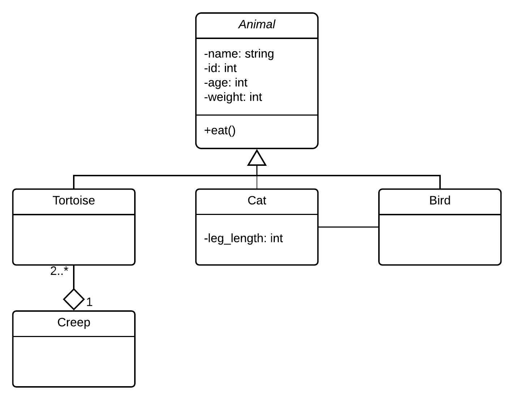

# Draw a UML Class Diagram
>The Unified Modeling Language (UML) is a general-purpose, developmental, modeling language in the field of software engineering that is intended to provide a standard way to visualize the design of a system.

from [Wikipedia](https://en.wikipedia.org/wiki/Unified_Modeling_Language)

## Question

Given `Animal` as an object. This object have `name(string)`, `id(int)`, `age(int)`, and `weight(int)` as attributes. It has 3 different kinds of animals. The first one is `Tortoise`, the second is `Cat`, and the last one is `Bird`. These 3 animals are the child class of the `Animal`. All these 3 animals have the same attributes as the `Animal` except for the `Cat` has one more attribute named `leg_length(int)`. However, if two or more `Tortoise` live together, then they can be called the `Creep`. The `Animal` also have function `eat()`. Only `Cat` can eat the `Bird`.

Draw a UML Class Diagram, show the relationship of each object by using symbols or the link.

## Answer

